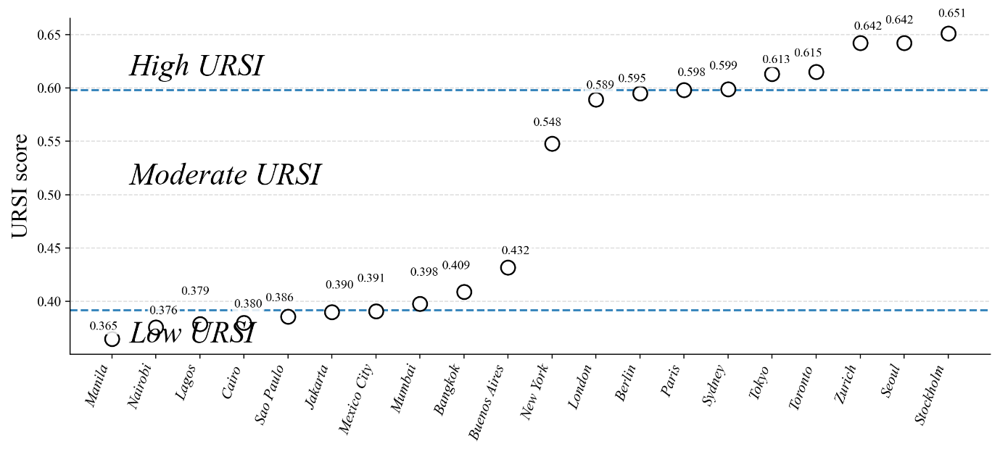

# urban-resilience-index

URSI: one scale for how well twenty very different cities would hold up
under climate, health and economic shocks.

IMMC 2026 (International Mathematical Modeling Challenge) · team of 4 · no award
My part: designed the complete 15-indicator system; contributed to the modeling.


---

## The question

Every city measures its own resilience with its own indicators, on its own
scale, from its own statistics bureau. Which makes the one question that
matters — *who is actually more exposed?* — unanswerable by construction.

So the whole problem is the ruler. Build one scale that is fair to Lagos
and Zurich at the same time, and the comparison does the rest.

## What I built

**Four dimensions, fifteen indicators.** Infrastructure & engineering
(population density, built-up ratio, road network, electricity
reliability), resource & environment (flood exposure, NO₂, greenness,
surface temperature), economy & finance (GDP per capita, unemployment,
nighttime-light growth and volatility), social governance & public health
(hospital beds, physicians, life expectancy).

Two design rules I held to:

- **Globally consistent sources only.** Remote-sensing products (NDVI,
  land-surface temperature, nighttime lights, built-up area) instead of
  national statistics wherever possible — a Lagos number and a Zurich
  number must mean the same thing. Three of the fifteen indicators are
  read from nighttime satellite imagery.
- **Keep my own judgment on a leash.** Weights come from ANP (expert
  structure, indicator interdependence) coupled with CRITIC (objective,
  from the data's own variance and correlation), synthesized through the
  rank-sum-ratio method. Neither my priors nor the data's quirks get to
  decide alone.

The team then extended URSI forward with an LSTM, forecasting 2025–2029
(out-of-sample R² = 0.689).

## What the scale showed

From our Figure 7:



The ten developing cities land between **0.365 and 0.432**; the ten
developed cities between **0.548 and 0.651**. Nothing in between: the
development gap isn't a gradient, it's a gap. The forecast adds a harder
edge to it — mid-ranked cities have the most room to move under targeted
policy, while the lowest-ranked face structural constraints that five
years won't dissolve.

## What this doesn't show

- Twenty cities is a designed sample, not the world. The clean two-cluster
  separation might blur with second-tier cities in between.
- Composite indices hide trade-offs: a city can buy index points with
  hospitals while its floodplain fills up.
- R² = 0.689 out of sample leaves a third of the variance unexplained —
  fine for direction-of-travel, not for ranking neighbors.
- We didn't place at IMMC 2026. The indicator system is the part I'd
  defend anywhere; the write-up needed more time than the contest window
  gave us.

## Files

```
assets/   the scale graphic + Figure 7 from the submission
paper/    full submission (IMMC26569116, 21 pp.)    [pending team's ok]
```

---

*One of four directions on [my profile](https://github.com/jerryxugit-2026) —
physics, art history, AI tooling, and public systems.*
